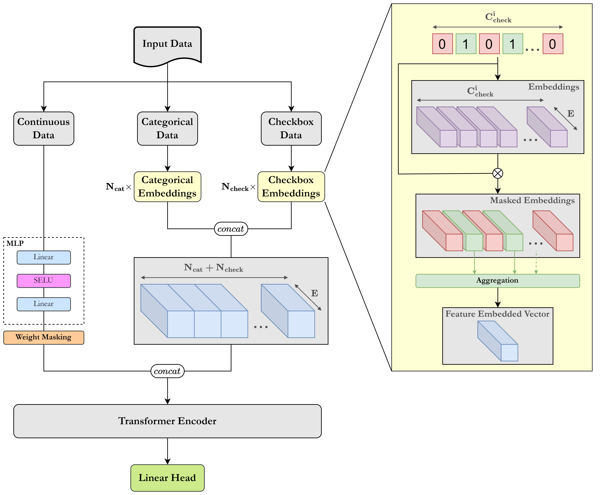

# TRACE
<p align="center">
  
</p>

> :page_with_curl: Source code accompanying the paper [TRACE: Transformer-based Risk Assessment for Clinical Evaluation](https://doi.org/10.1109/ACCESS.2025.3577973)
>
> :black_nib: Authors: Dionysis Christopoulos, Sotiris Spanos, Valsamis Ntouskos, Konstantinos Karantzalos
>
> :classical_building: Remote Sensing Lab, National Technical University of Athens, Greece

## :loudspeaker: News

- **[2025.06.09]** TRACE is now published in [IEEE Access](https://doi.org/10.1109/ACCESS.2025.3577973) :tada:
- **[2024.12.04]** Code for the paper is now publicly available!
- **[2024.11.14]** Initial manuscript version uploaded on [arXiv](https://arxiv.org/abs/2411.08701)

## Paper summary

We present a novel method for clinical risk assessment based on medical record data, leveraging the self-attention mechanism for enhanced feature interaction. Our approach is able to handle heterogeneous structured data, including continuous, categorical and multiple-choice (checkbox) features. The proposed architecture features a shared representation of the heterogeneous medical record data obtained by integrating suitable feature embeddings, enabling the detection of high-risk individuals using Transformer encoder layers.

<div align="center">
  
</div>

<br>

>**_Figure 1: Network architecture._** TRACE supports three types of input data: continuous, categorical, and "checkbox" features. Continuous data is processed through a two-layer MLP with a weight masking mechanism on its outputs. Categorical and "checkbox" data are embedded through their respective embedding layers. All embeddings are concatenated and fed into a transformer encoder block. Finally, an MLP head can either output the predicted class for a binary classification task (disease presence or absence), or generate a percentage representing the participant's risk score of a positive diagnosis for the disease under consideration.

## :hammer_and_wrench: Requirements

A conda environment named `trace` can be created and activated with:

```
conda env create -f environment.yaml
conda activate trace
```

Alternatively:

```
pip install -r requirements.txt
```

## :fire: Training

Run the following command to end-to-end train the model:
```
python main_trace.py --config_file ./config/CONFIG_NAME.yaml --output_dir ./results/EXP_NAME
```

>:exclamation:**NOTE:** Replace `CONFIG_NAME` with the name of your config file and `EXP_NAME` with the name of your experiment.

## :zap: Validation

For validation, after training, run the following command:
```
python main_trace.py --config_file ./config/CONFIG_NAME.yaml --output_dir ./results/EXP_NAME --eval --checkpoint ./results/EXP_NAME/ckpt_best.pth
```

## :rocket: Citation

```
@misc{christopoulos2024tracetransformerbasedriskassessment,
      title={TRACE: Transformer-based Risk Assessment for Clinical Evaluation}, 
      author={Dionysis Christopoulos and Sotiris Spanos and Valsamis Ntouskos and Konstantinos Karantzalos},
      year={2024},
      eprint={2411.08701},
      archivePrefix={arXiv},
      primaryClass={cs.CV},
      url={https://arxiv.org/abs/2411.08701}, 
}
```